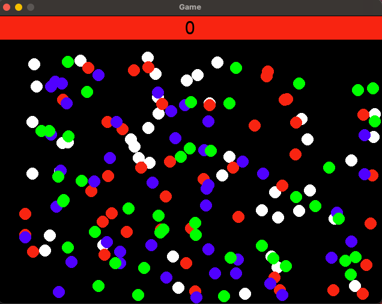
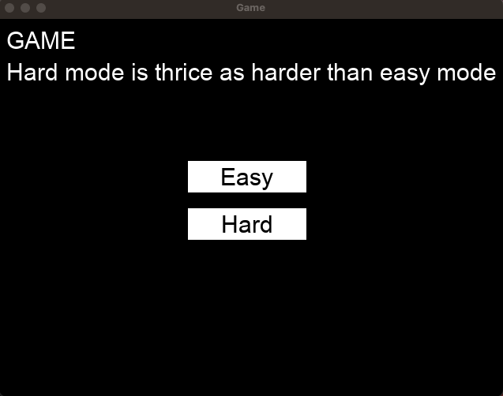
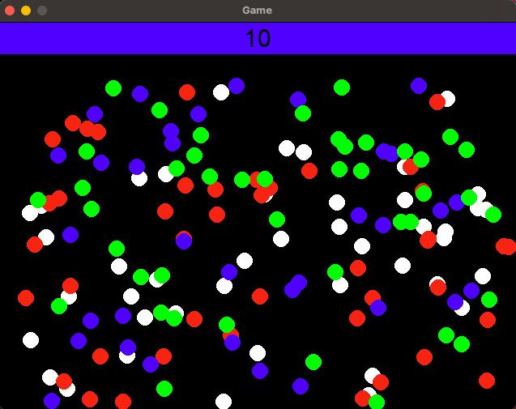
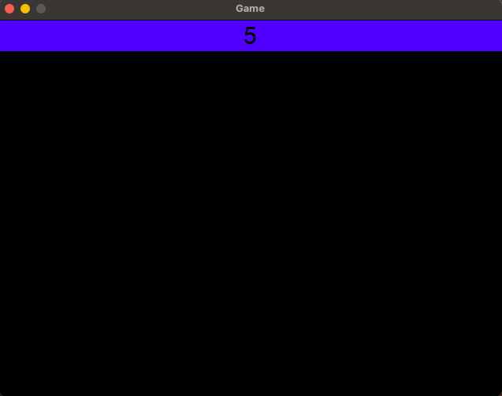

# 🎯 Color Click Challenge

Color Click Challenge is a fast-paced reaction game built using Python and Pygame. The objective is to click on circles that match a randomly selected target color while avoiding incorrect ones. The game features two difficulty levels (Easy and Hard), timed gameplay using custom alarm logic, and multiple game states (rooms).

---

## 🧠 About This Project

This game was originally built as a **high school project** to practice and apply my knowledge of Python programming and basic game development using the **Pygame** library. I built the entire game logic from scratch, including:

- Designing a **multistage game flow** with a main menu, active gameplay, and a score display scene.
- Creating a **custom game engine framework** (`game_engine.py`) with reusable components like `Game`, `Room`, `GameObject`, and `Alarm`.
- Implementing **clickable UI elements** using classes like `TextRectangle` and `TextCircle`.
- Using **OOP principles** (inheritance, encapsulation) to manage game entities like circles, alarms, and buttons.
- Programming **real-time gameplay logic**, including random object placement, collision detection, mouse interaction, and time-based events.
- Managing multiple **game difficulties** (Easy and Hard) using different timers and behaviors.
- Creating over 150+ dynamically placed colored circle objects, each with randomized behavior.

This was **completely self-taught** and done without any tutorials — just raw experimentation, debugging, and passion to build something fun and playable.

---

## 🖼️ Preview

<!-- SCREENSHOT -->


---

## 🎮 Game Objective

Click on as many circles as possible that **match the target color** displayed at the top of the screen with the current score you have.  
Each correct click adds to your score. Wrong clicks reset your score to 0.

Choose between:
- **Easy Mode**: More time 
- **Hard Mode**: Less time 

---

## 🧠 Features

- ✅ Pygame-based UI and game loop
- ✅ Clickable text buttons for difficulty selection
- ✅ Timed gameplay using a custom `Alarm` class
- ✅ Room/scene transitions (`Room 1`: Menu → `Room 2`: Game → `Room 3`: Score display)
- ✅ Randomly positioned color circles (White, Red, Green, Blue)
- ✅ Real-time score tracking and display
- ✅ Modular architecture using custom classes

---

## 🛠️ How to Run

### 1. Install Requirements

Make sure you have Python installed, then:

```bash
pip install pygame
```

### 2. Run the Game

```bash
python Colour_clicker_game.py
```

---

## 💻 Screenshots

### 🧭 Main Menu
<!-- SCREENSHOT -->


---

### 🎯 Game in Progress
<!-- SCREENSHOT -->


---

### 🏁 Score Screen
<!-- SCREENSHOT -->


---

## ⚠️ Known Issues

### 🖱️ MacOS Mouse Click Bug

On some MacBooks (especially with Retina displays), **Pygame’s mouse click detection may not work properly** — especially when clicking inside text boxes or UI elements.

**Temporary Fix**:  
> Try clicking on the **top-left corner** of the button or text box. This workaround improves detection.

**Note**: This is a known Pygame/macOS interaction issue and cannot be fully resolved with code. It does *not* affect Windows or most Linux distributions.

---

## 🧪 What I Learned

Even though the code may not reflect best practices in every area, it demonstrates real experience building and debugging complete, functional Python applications.

Key takeaways include:

- Using Python’s object-oriented features
- Structuring modular game code
- Handling input events and user interaction
- Managing UI components and scenes in Pygame
- Working with randomness and timers in gameplay

---
## 📜 License

This project is open for educational and showcase purposes. Feel free to fork and build upon it!
